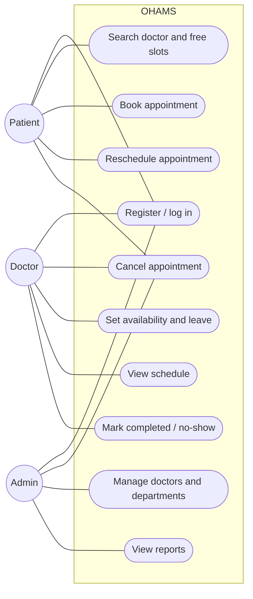
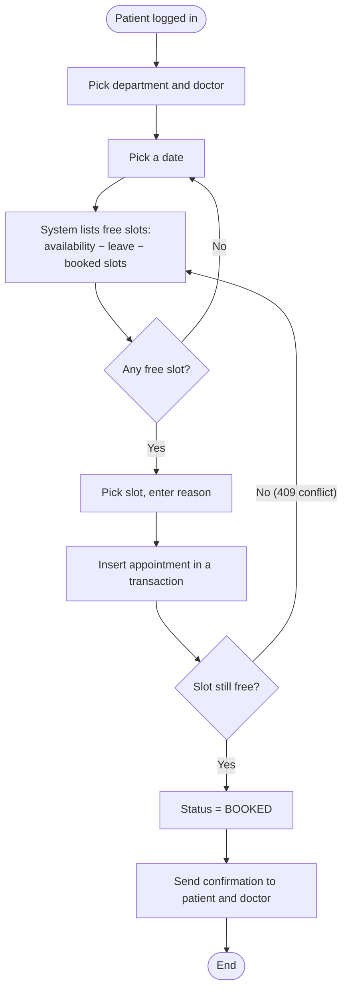
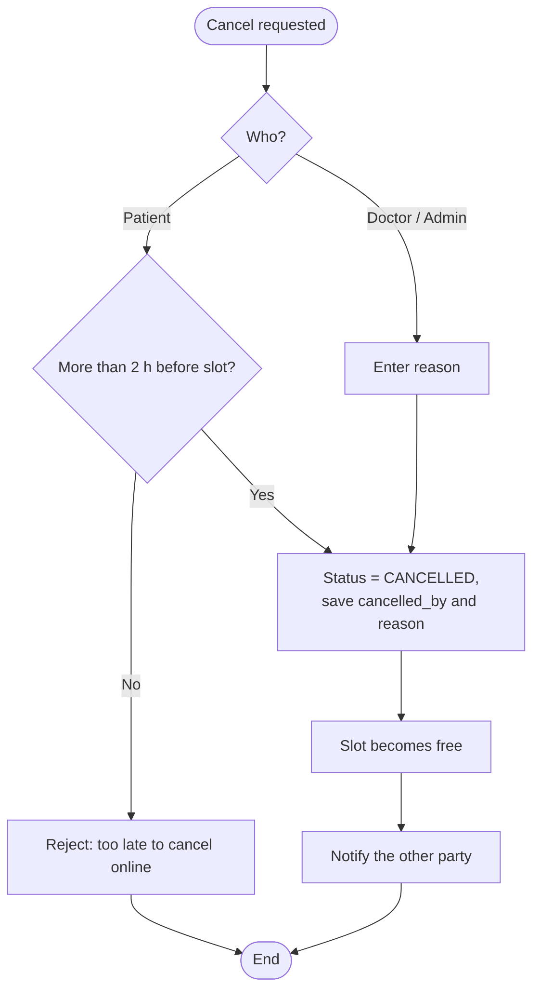

# Appointment workflow (OHAMS-12)

## Use cases

```mermaid
flowchart LR
    P((Patient))
    D((Doctor))
    A((Admin))
    subgraph OHAMS
        UC1([Register / log in])
        UC2([Search doctor and free slots])
        UC3([Book appointment])
        UC4([Reschedule appointment])
        UC5([Cancel appointment])
        UC6([Set availability and leave])
        UC7([View schedule])
        UC8([Mark completed / no-show])
        UC9([Manage doctors and departments])
        UC10([View reports])
    end
    P --- UC1 & UC2 & UC3 & UC4 & UC5
    D --- UC1 & UC5 & UC6 & UC7 & UC8
    A --- UC1 & UC5 & UC9 & UC10
```

## Booking flow

```mermaid
flowchart TD
    S([Patient logged in]) --> A[Pick department and doctor]
    A --> B[Pick a date]
    B --> C[System lists free slots:<br/>availability − leave − booked slots]
    C --> E{Any free slot?}
    E -- No --> B
    E -- Yes --> F[Pick slot, enter reason]
    F --> G[Insert appointment in a transaction]
    G --> H{Slot still free?}
    H -- "No (409 conflict)" --> C
    H -- Yes --> I[Status = BOOKED]
    I --> J[Send confirmation to patient and doctor]
    J --> X([End])
```

## Cancellation flow

```mermaid
flowchart TD
    S([Cancel requested]) --> R{Who?}
    R -- Patient --> W{More than 2 h before slot?}
    W -- No --> N[Reject: too late to cancel online] --> X([End])
    W -- Yes --> C
    R -- "Doctor / Admin" --> Q[Enter reason] --> C
    C[Status = CANCELLED,<br/>save cancelled_by and reason] --> F[Slot becomes free]
    F --> M[Notify the other party] --> X
```
